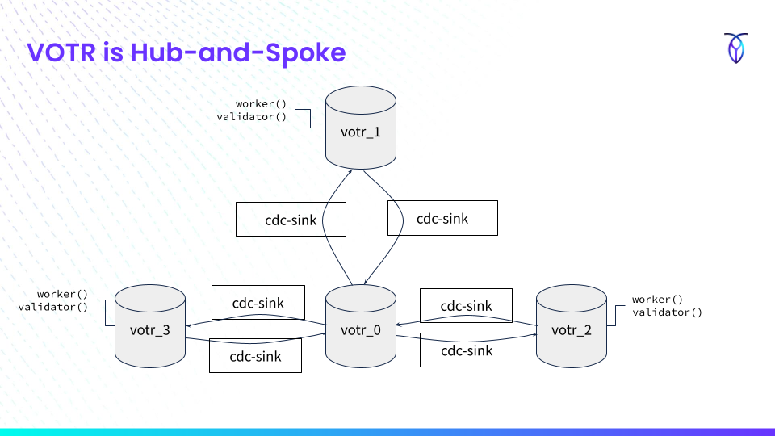

# VOTR

The VOTR workload demonstrates a hub-and-spoke replication workload that
uses cdc-sink's merge features.

The core workload demonstrates a ballot-casting system. There are three tables:
* `candidates` is an infrequently-updated table that uses a version
  column and last-one-wins behaviors
* `ballots` is an append-only table with a composite primary key of
  `(candidate uuid, ballot uuid)`
* `totals` maintains per-candidate running totals. It is intended to
  show how a high-contention table can be logically replicated; this is
  not an ideal pattern for CockroachDB.

VOTR shows a hub-and-spoke replication model, but it can also operate in
a two-datacenter (2-DC) model. The `votr_0` database is used as the hub,
and an arbitrary number of "spoke" databases, `votr_N` run the workload.
Each hub-spoke pair has two unidirectional changefeeds, each of which
are processed by independent `cdc-sink` instances.  There are a total of
six independent feeds that are operating in this demonstration.



The worker attached to each spoke selects a random number of candidates
and casts one or more ballots to each of them. The VOTR worker knows
nothing about the replication model. The workload is roughly:
* `BEGIN`
* For random Candidate and Number of votes:
  * `UPDATE totals SET total = total + N WHERE candidate = C`
  * `INSERT INTO ballots (candidate) VALUES (C, generate_series(1, N))`
* `COMMIT`

Each spoke also has a validation loop that checks whether or not the
total number of ballots equals the running total of all totals. That is
`SELECT count(*) FROM ballots` should equal `SELECT sum(total) FROM
totals` at any given point in time.

The only SQL client to interact with the `votr_0` hub is cdc-sink.

The tables used by the `VOTR` workload are augmented with a vector-clock
scheme. That is, each table has a `whence JSONB` column that shows which
worker(s) a row incorporates state from. A `src INT` column also allows
the `vectorMerge()` function defined in the [votr.ts user
script](./script/votr.ts) to ensure idempotency by ensuring that the
clock for a particular source only ever rolls forwards.  Note that the
functionality does *not* depend on clock synchronization between the
workers, only that each worker has a reasonably well-behaved cluster
timestamp.

# Running the demo

Start one or more local CockroachDB instances. The VOTR workload can use
multiple SQL databases on a single CockroachDB node, or the databases
can be split across multiple clusters.
> `cockroach start-single-node --store type=mem,size=2G --advertise-addr 127.0.0.1:26257  --insecure `

Initialize the VOTR schema on each instance. The number of regions is
specified by repeating the `--connect` argument. It is valid to have
duplicate connection strings to use the same CockroachDB node or cluster
to host multiple VOTR databases. This command-line shows the local
CockroachDB node being used to host the hub and three spokes.
> `cdc-sink votr init
> --connect 'postgresql://root@localhost:26257/?sslmode=disable'
> --connect 'postgresql://root@localhost:26257/?sslmode=disable'
> --connect 'postgresql://root@localhost:26257/?sslmode=disable'
> --connect 'postgresql://root@localhost:26257/?sslmode=disable'`

Run the workload. The `--drainDelay` flag sets a timeout after receiving
a `^C` for the workers to stop, but to allow the cdc-sink instances to
continue to process messages.
> `cdc-sink votr run
> --candidates 128 --workers 1 --drainDelay 1m
> --connect 'postgresql://root@localhost:26257/?sslmode=disable'
> --connect 'postgresql://root@localhost:26257/?sslmode=disable'
> --connect 'postgresql://root@localhost:26257/?sslmode=disable'
> --connect 'postgresql://root@localhost:26257/?sslmode=disable'`

# Useful demo query

Show the count of ballots and sum total across multiple VOTR database on
the same node:
```sql
WITH t (n, t) AS (                                         
                     SELECT 1 AS n, sum(total)             
                       FROM votr_1.totals                  
                     UNION ALL SELECT 2 AS n, sum(total)   
                                 FROM votr_2.totals        
                     UNION ALL SELECT 3 AS n, sum(total)   
                                 FROM votr_3.totals        
                     UNION ALL SELECT 0 AS n, sum(total)   
                                 FROM votr_0.totals        
                ),                                         
       c (n, c) AS (                                       
                     SELECT 1, count(*) FROM votr_1.ballots
                     UNION ALL SELECT 2, count(*)          
                                 FROM votr_2.ballots       
                     UNION ALL SELECT 3, count(*)          
                                 FROM votr_3.ballots       
                     UNION ALL SELECT 0, count(*)          
                                 FROM votr_0.ballots       
                )                                          
SELECT *                                                   
  FROM t JOIN c USING (n) order by n;
```

# Known limitations

* VOTR is a one-shot demo since the changefeeds are deleted on exit. The
  cdc-sink HTTP ports are ephemeral, so it's not straightforward to
  continue from a previous run. With more development effort, VOTR could
  query the jobs table to determine which port it should attempt to bind
  a listener to, in order to use the existing state.
* VOTR should demonstrate adding a new region.