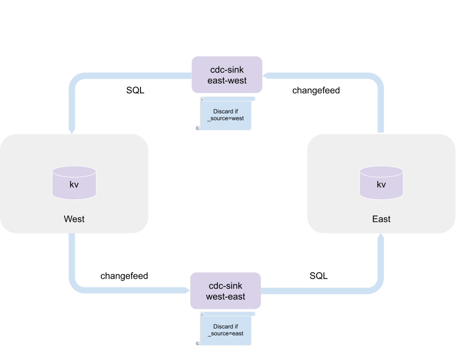

# Docker demo of active-active replication

This demo sets up 2 single node clusters and 2 cdc-sink instances to replicate data two ways,
as shown in the diagram.



It has a simple conflict resolution, where conflicts are stored in dead letter queue table.
We use the KV workload to simulate conflicting or disjoint workloads.

The demo can be started using docker compose, leveraging profiles to start the different components.

## Configuration

You will need to set the `COCKROACH_DEV_LICENSE` and `COCKROACH_DEV_ORGANIZATION` environment variables.

```bash
export COCKROACH_DEV_LICENSE="_your_license_key"
export COCKROACH_DEV_ORGANIZATION="_your_organization_name"
```

Alternatively, create a `.env` file to set the values of the variables.

## Starting the services

Starting the Cockroach clusters, cdc-sink processes and initializing the environment:

```bash
docker compose up -d
```

To pass additional arguments to cdc-sink use the `CDC_ARGS` env variable.
`CDC_ARGS` can be also set in the `.env` file.

For instance, to start with best effort only  mode:

```bash
CDC_ARGS=--bestEffortOnly docker compose up -d
```

To access the DB console, you can find out the local port of each cluster by running:

```bash
docker compose port east 8080
```

```bash
docker compose port west 8080
```

## Monitoring

To start the optional monitoring environment, add `--profile monitor` to the command above:
(if ran again, it will check that the core services are up and healthy)

```bash
docker compose --profile monitor up -d
```

Docker will start Prometheus and Grafana and initialize the monitoring environment to
connect to the Cockroach Clusters and the cdc-sink processes.
To find out on which port the Grafana dashboard is available use:

```bash
docker compose port grafana 3000
```

The default user,password is `admin`/`cdc-sink`.
Using the `PORT` returned by the command above, open a browser to http://localhost:PORT/d/cdc-sink

## Running the workload

To run the kv workload with conflicts, using the same sequence number for both workloads.

```bash
docker compose run  --rm concurrent_workloads
```

To run the kv workload with no conflicts, use disjoint sequence numbers, by setting
the `START_EAST` or `START_WEST` environment variables.

```bash
START_EAST=100000 docker compose run  --rm concurrent_workloads
```

The kv uses sequential keys, so it's easier to compare the data on the 2 clusters.
It also possible a workload on each cluster separately, using 

```bash
docker compose run  --rm east_workload
```

or

```bash
docker compose run  --rm west_workload
```

There are few variables that can be used to change the behavior of the workload:

- `START_EAST`: the starting sequence for the east cluster. Default: 0.
- `START_WEST`: the starting sequence for the west cluster. Default: 0.
- `DURATION`: the duration of the test. Default: 60s.
- `RATE`: the insert rate. Default: 100 inserts/second.

We are adding 2 columns to each table that we need to replicate.

- `_source` indicates where the change was originally made.
- `_timestamp` is a timestamp in the future to take into account for a window of uncertainty
(for the demo we are using one second in the future).

## Checking results

To check results, use the SQL client on either clusters, by running either the `east_sql`
or `west_sql` services.

```bash
docker compose run --rm -it west_sql 
```

To view the content of the kv table, including the columns used by the cdc-sink to perform replication:

```sql
root@west:26257/defaultdb> SELECT *,_source,_timestamp from kv.kv limit 10
```

To check the content of the DLQ table:

```sql
root@west:26257/defaultdb> select * from kv.cdc_sink_dlq limit 10;
```

## Clean up

To remove all the containers, volumes from the docker environment:

```bash
docker compose --profile monitor --profile workload --profile sql down -v
```

## Implementation Notes

NOTE: Deletes not currently supported.

The docker environment provides a simple setup, however this can be extended to
any environments that require active-active replication between two clusters
by implementing the following instructions. For simplicity, we'll refer to the
two clusters as `east` and `west`.

### Schema requirements

To set up the `cdc-sink` environment, create a `_cdc_sink` database on both clusters,
and a table in each destination database to collect any conflicts that may arise:

```sql
-- Database used by cdc-sink to stage mutation and maintain replication state.
CREATE DATABASE if NOT EXISTS _cdc_sink

-- DLQ table in the database being replicated:

CREATE TABLE IF NOT EXISTS cdc_sink_dlq (
event UUID DEFAULT gen_random_uuid() PRIMARY KEY,
dlq_name TEXT NOT NULL,
source_nanos INT8 NOT NULL,
source_logical INT8 NOT NULL,
data_after JSONB NOT NULL,
data_before JSONB NOT NULL
);

```

In order for the `cdc-sink` process to correctly process updates, we need to provide
information on the origin of each mutation, so we avoid replication infinite loops.
We also keep track of timestamps, to resolve conflicts.
This is accomplished by adding 2 hidden columns (`_source` and `_timestamp`) to each
table that needs to be replicated.

For instance, to change the kv table on the `east` cluster:

```sql

ALTER TABLE kv.kv
  ADD COLUMN _source string  NOT VISIBLE default 'east' on update 'east',
  ADD COLUMN _timestamp timestamptz NOT VISIBLE DEFAULT now() + '1s' on update now() + '1s'

```

We add one second to the current timestamp, to account for a window of uncertainty. This can
be adjusted, depending on the network latency between the two clusters.

### Running cdc-sink

The flow control and conflict resolution are implemented by providing a user script
to cdc-sink. As a convenience, we provide a module `repl.ts` to setup the replication
logic on each `cdc-sink` process.
We recommend to start a `cdc-sink` process on each node of the target (`west`) cluster, and
configure a layer 7 HTTP/2 load balancer to receive changefeed events from the
source (`east`) cluster. The same setup is needed for the `west` to `east` flow.

For instance, start cdc-sink running on each `west` nodes to receive `east` traffic 
will apply it to the local CockroachDB node:

```bash
cdc-sink start --bindAddr :30004 --metricsAddr :30005 \
               --tlsSelfSigned --disableAuthentication \
               --targetConn 'postgresql://root@local:26257/?sslmode=disable' \
               --userscript init.ts
```

A sample `init.ts` to replicate the `kv.public.kv` table from the `kv.public` schema
to the `west` cluster:

```javascript
import {replicateTo} from "repl";
replicateTo('west','kv.public', ['kv.public.kv'])
```

The `repl.ts` module, used by `init.ts` (both script must be in the same directory where
`cdc-sink` is started):

```javascript
import * as api from "cdc-sink@v1";
import { Document, Table } from "cdc-sink@v1";

export function replicateTo(region: string, schema: string, tables: string[]) {
    console.log("configureSource " + schema)
    api.configureSource(schema, {
        dispatch: (doc: Document, meta: Document): Record<Table, Document[]> => {
            console.trace(JSON.stringify(doc), JSON.stringify(meta));
            let ret: Record<Table, Document[]> = {};
            if (doc._source !== region) {
                console.log("Processing " + doc.k + "(" + typeof doc.k + "):" + doc._source)
                ret[meta.table as string] = [doc];
            } else {
                console.log("Skipping " + doc.k + ":" + doc._source)
            }
            return ret
        },
        deletesTo: ""
    })

    for (let table of tables) {
        console.log("configureTable " + table)
        api.configureTable(table, {
            cas: ['_timestamp'],
            merge: api.standardMerge(() => ({ dlq: table }))
        })}
}

```

Once configured, cdc-sink will:

- discard any incoming messages that have in the `_source` column the value of the destination.
- if there is a conflict (e.g. there is already a row with the same key in the destination table),
then check if the `_timestamp` of the incoming row is newer:
  - if it is, update the row;
  - if not, send the row to the DLQ table.

### Changefeed

Make sure rangefeed are enable on both clusters, by running:

```sql
SET CLUSTER SETTING kv.rangefeed.enabled = true;
```

As an example, to start a changefeed to replicate the kv.kv table to the `west` cluster:

```sql
  CREATE CHANGEFEED FOR TABLE kv.kv
  INTO 'webhook-https://west_loadbalancer:30004/kv/public?insecure_tls_skip_verify=true'
  WITH diff, updated, resolved='1s', webhook_sink_config = '{"Flush":{"Bytes":1048576,"Frequency":"1s"}}';

```
