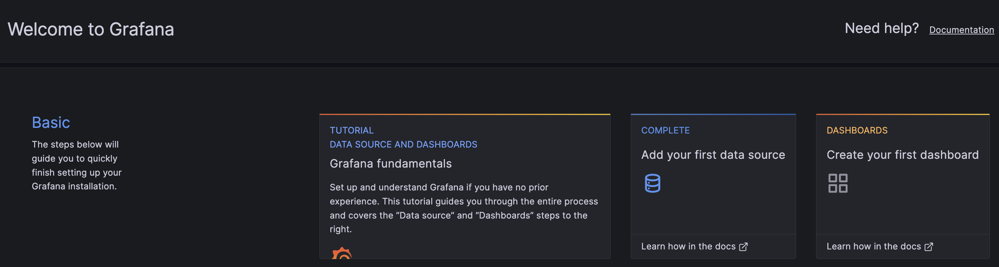
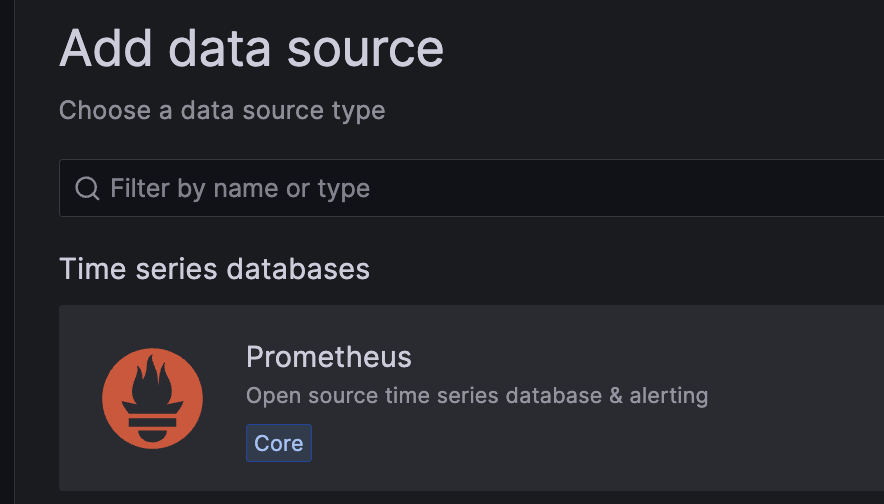
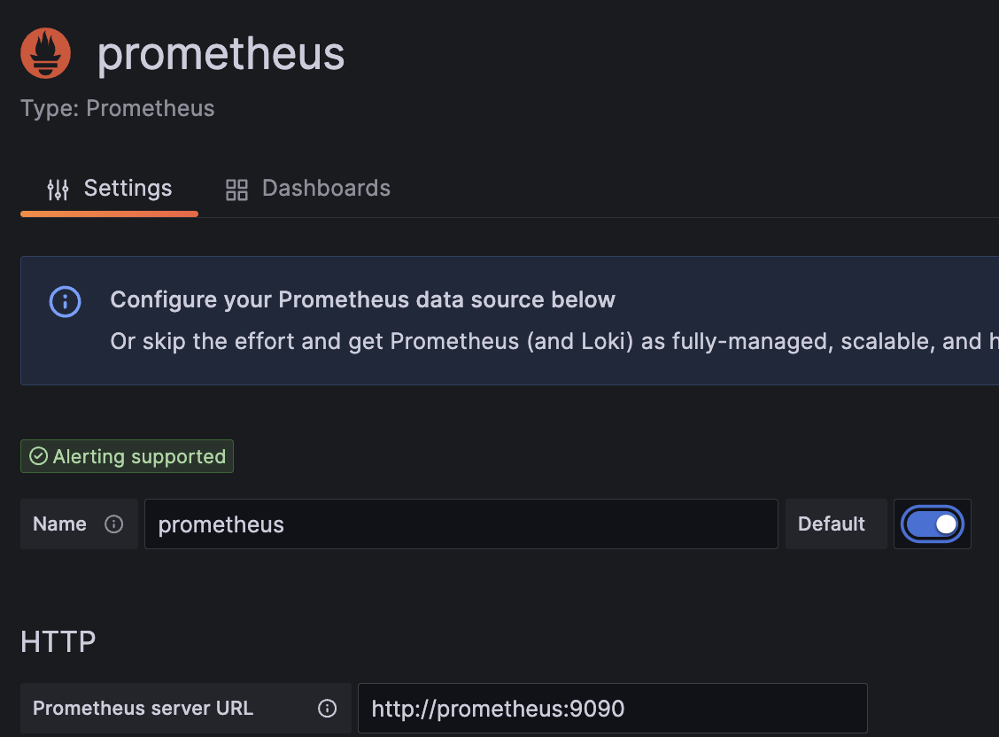
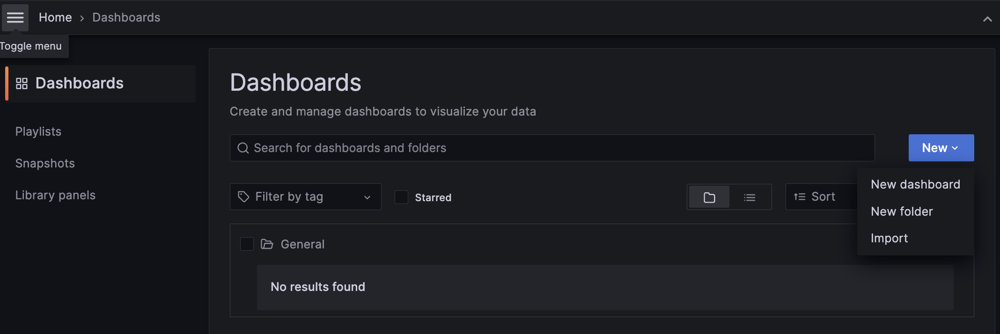
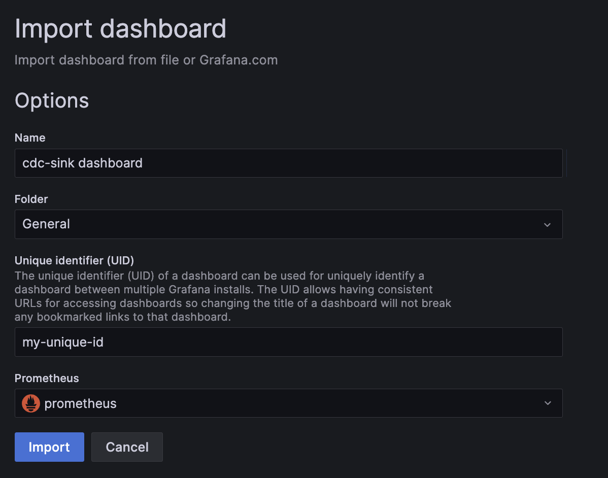
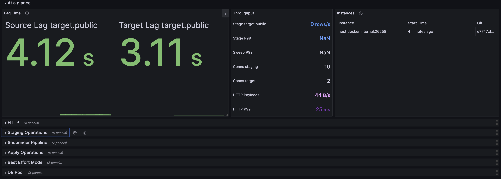

# Grafana Dashboard

This directory contains a [Grafana dashboard](./cdc-sink.json) which can
be imported into a new or existing Grafana cluster. It is pre-configured
with a number of panels that show the various stages of processing a
mutation.

The docker-compose file in this directory will launch Prometheus and
Grafana. It will be necessary to add prometheus as a data source and to
import the dashboard template.

## Quickstart

* Execute `docker-compose --profile monitor up` to launch the containers.
* Connect to `http://127.0.0.1:3000` and log in with "admin" as the
  username and password.
* Add Prometheus as a data source:
  
  
* Enter `http://prometheus:9090` as the server address and save the connection.
  
* Navigate to the Dashboards tab, and select "New > Import"
  
* When you have selected the `cdc-sink.json` file, associate it with
  the Prometheus datasource that you previously created.
  
* The dashboard should be loaded. Ensure that at least one instance of
  cdc-sink has been detected. If not, adjust the hostname(s) in the
  prometheus.yaml file and `docker kill -s HUP <promethus container>`.
  